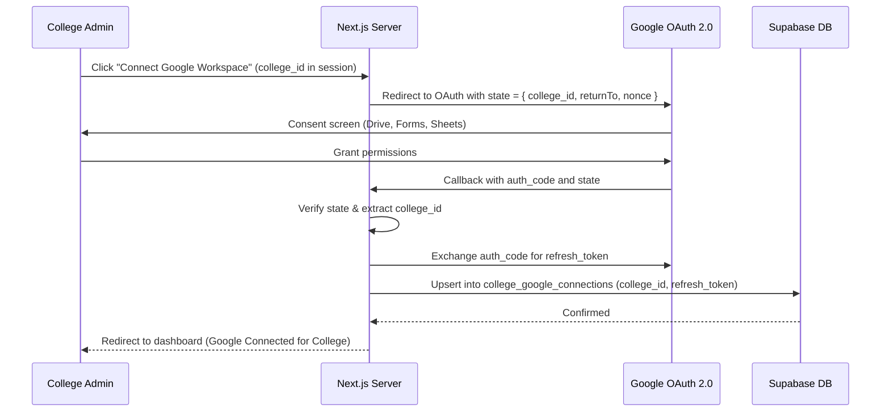

# Phase 1B — Database & Entity-Relationship Architecture Design
## Multi-Tenant Feedback Management System (FMS) Platform

**Document Version:** 1.0.0 (Frozen Phase 1B Design)  
**Target Environment:** New Supabase Project (`txerarcajxjzxifanzxw`)  
**Scope:** Architectural Design & Entity-Relationship Specifications Only  
**Safety Status:** Static Design Only — Zero Database Migrations or Code Modifications Executed

---

## Table of Contents
1. [Executive Architectural Summary](#1-executive-architectural-summary)
2. [Final Entity Catalog](#2-final-entity-catalog)
3. [Platform vs. Tenant Boundary Matrix](#3-platform-vs-tenant-boundary-matrix)
4. [Entity-Relationship Diagram (Mermaid)](#4-entity-relationship-diagram-mermaid)
5. [Table-by-Table Schema Specifications](#5-table-by-table-schema-specifications)
6. [Primary Key, Foreign Key & Composite Constraints](#6-primary-key-foreign-key--composite-constraints)
7. [Comprehensive Indexing Strategy](#7-comprehensive-indexing-strategy)
8. [Row Level Security (RLS) & Authorization Strategy](#8-row-level-security-rls--authorization-strategy)
9. [Authentication & Membership Model](#9-authentication--membership-model)
10. [Google Workspace / OAuth Isolation Model](#10-google-workspace--oauth-isolation-model)
11. [Tenant-Scoped Billing & Entitlement Model](#11-tenant-scoped-billing--entitlement-model)
12. [Feedback Forms, Items & Response Sync Model](#12-feedback-forms-items--response-sync-model)
13. [Platform & Tenant Audit Logging Model](#13-platform--tenant-audit-logging-model)
14. [Cascading & Deletion Lifecycle Strategy](#14-cascading--deletion-lifecycle-strategy)
15. [End-to-End Tenant Isolation & Anti-IDOR Checklist](#15-end-to-end-tenant-isolation--anti-idor-checklist)
16. [BCE Production Migration & Legacy Compatibility Analysis](#16-bce-production-migration--legacy-compatibility-analysis)
17. [Final Frozen Decisions](#17-final-frozen-decisions)
18. [Open Architectural Considerations](#18-open-architectural-considerations)

---

## 1. Executive Architectural Summary

The Feedback Management System (FMS) is evolving from a single-institution application (Bhagalpur College of Engineering) into a **centralized, multi-tenant academic feedback platform**. The platform enables colleges across the Bihar technical education ecosystem (e.g., BCE Bhagalpur, GEC Gaya, MCE Motihari, MIT Muzaffarpur) to operate on a single shared codebase, single unified deployment, and single PostgreSQL/Supabase database while guaranteeing complete data, branding, billing, and operational isolation.

### Architectural Tenets
1. **Single Deployment, Strict Multi-Tenancy:** A single Next.js web application deployed to Vercel connected to a single Supabase backend.
2. **Canonical Tenant Identifier:** Every college-owned entity is partitioned by `college_id (UUID NOT NULL REFERENCES public.colleges(id))`.
3. **URL Slug vs. Security Boundary:** College URL slugs (`/bce-bgp`, `/gec-gaya`) identify tenants for routing and branding resolution, but are **never** treated as an authorization boundary. Authorization is strictly enforced via `auth.uid()`, college memberships, and PostgreSQL Row-Level Security (RLS).
4. **Isolated Integrations:** Google Workspace connections (OAuth refresh tokens, Forms, Sheets, Drive files) are strictly college-scoped. A security failure or configuration in one college cannot breach or impact another.
5. **Tenant-Scoped Billing:** Billing accounts, payment verifications, and feature entitlements attach to the college tenant rather than individual administrator accounts.

---

## 2. Final Entity Catalog

### Platform-Level Entities (Shared Platform Infrastructure)
1. **`colleges`**: The core tenant entity storing college identities, unique slugs, AICTE/university affiliation, and full branding palettes.
2. **`platform_admins`**: Super-administrators with cross-tenant oversight, billing management, and platform provisioning authority.
3. **`billing_plans`**: The authoritative catalog of platform subscription tiers (`FREE`, `MONTHLY`, `YEARLY`, etc.) and their feature sets.
4. **`payment_settings`**: Global payment receiving details (platform UPI ID, bank account, support contact) managed by platform super-admins.

### College Tenant Entities (Isolated Per College)
5. **`college_memberships`**: Connects canonical Supabase Auth identities (`auth.users.id`) to colleges with defined roles (`COLLEGE_ADMIN`).
6. **`college_admin_requests`**: Tenant-scoped requests submitted by faculty/staff seeking administrator status for a specific college.
7. **`college_google_connections`**: College-dedicated Google OAuth refresh tokens and connection metadata (replaces legacy global singleton).
8. **`academic_years`**: College-specific academic sessions (e.g., "2025-2026").
9. **`branches`**: Academic departments/branches specific to each college (e.g., "CSE", "ECE", "Civil").
10. **`semesters`**: Active semester curriculum partitions per college (Semesters 1 through 8).
11. **`faculties`**: Teaching staff and professors employed by the specific college.
12. **`subjects`**: Course curricula and subject offerings taught within the college.
13. **`faculty_subject_assignments`**: College-specific mappings of faculty to subjects for given sessions, branches, and semesters.
14. **`feedback_forms`**: Core feedback collection campaigns generated by college admins.
15. **`feedback_form_items`**: Sub-evaluations for multi-faculty semester forms (scoped strictly through parent `feedback_forms`).
16. **`feedback_response_records`**: Student submission receipts, verification tokens, and confirmation email statuses synced from Google Forms/Sheets.
17. **`college_billing_accounts`**: Per-college plan assignment, unlock status (`LOCKED`/`UNLOCKED`), and subscription lifecycle.
18. **`college_trial_entitlements`**: Temporary feature trials granted to a college by platform super-admins.
19. **`college_payment_requests`**: Submissions by college admins for plan activation/renewal with payment proofs for verification.
20. **`audit_logs`**: System activity trail, supporting both platform-level events (`college_id IS NULL`) and tenant-level events (`college_id NOT NULL`).

---

## 3. Platform vs. Tenant Boundary Matrix

| Entity | Level | Partition Key (`college_id`) | Publicly Readable? | Primary Mutator |
| :--- | :--- | :--- | :--- | :--- |
| `colleges` | Platform | `id` (is the PK) | Yes (Active only: branding, slug, name) | `PLATFORM_SUPER_ADMIN` |
| `platform_admins` | Platform | N/A | No (Strictly restricted) | `PLATFORM_SUPER_ADMIN` |
| `billing_plans` | Platform | N/A | Yes (Active plans for pricing display) | `PLATFORM_SUPER_ADMIN` |
| `payment_settings` | Platform | N/A | Authenticated College Admins | `PLATFORM_SUPER_ADMIN` |
| `college_memberships` | Tenant | `college_id NOT NULL` | No | College Admin / Platform Admin |
| `college_admin_requests`| Tenant | `college_id NOT NULL` | No (Applicant reads own) | College Admin / Platform Admin |
| `college_google_connections`| Tenant| `college_id NOT NULL UNIQUE` | No (Status boolean only via action) | Server Action (`service_role`) |
| `academic_years` | Tenant | `college_id NOT NULL` | Yes (if active, for student discovery) | `COLLEGE_ADMIN` |
| `branches` | Tenant | `college_id NOT NULL` | Yes (if active, for student discovery) | `COLLEGE_ADMIN` |
| `semesters` | Tenant | `college_id NOT NULL` | Yes (if active, for student discovery) | `COLLEGE_ADMIN` |
| `faculties` | Tenant | `college_id NOT NULL` | Yes (if active, for student discovery) | `COLLEGE_ADMIN` |
| `subjects` | Tenant | `college_id NOT NULL` | Yes (if active, for student discovery) | `COLLEGE_ADMIN` |
| `faculty_subject_assignments` | Tenant | `college_id NOT NULL` | Yes (if active, for cascading selector) | `COLLEGE_ADMIN` |
| `feedback_forms` | Tenant | `college_id NOT NULL` | Yes (if `PUBLISHED` or `CLOSED`) | `COLLEGE_ADMIN` |
| `feedback_form_items` | Tenant | Derived via `form_id` | Yes (if parent form is published) | `COLLEGE_ADMIN` |
| `feedback_response_records` | Tenant | `college_id NOT NULL` | No (Student privacy protected) | Sync Service (`service_role`) |
| `college_billing_accounts` | Tenant | `college_id NOT NULL UNIQUE` | No | Platform Admin / System Sync |
| `college_trial_entitlements` | Tenant | `college_id NOT NULL` | No | `PLATFORM_SUPER_ADMIN` |
| `college_payment_requests` | Tenant | `college_id NOT NULL` | No | College Admin / Platform Admin |
| `audit_logs` | Hybrid | `college_id NULLABLE` | No | System Server Actions |

---

## 4. Entity-Relationship Diagram (Mermaid)

```mermaid
erDiagram
    COLLEGES ||--o{ COLLEGE_MEMBERSHIPS : "has administrators"
    COLLEGES ||--o{ COLLEGE_ADMIN_REQUESTS : "receives access requests"
    COLLEGES ||--o| COLLEGE_GOOGLE_CONNECTIONS : "owns Google OAuth"
    COLLEGES ||--o| COLLEGE_BILLING_ACCOUNTS : "has billing state"
    COLLEGES ||--o{ COLLEGE_TRIAL_ENTITLEMENTS : "granted trials"
    COLLEGES ||--o{ COLLEGE_PAYMENT_REQUESTS : "submits payments"
    COLLEGES ||--o{ ACADEMIC_YEARS : "manages academic years"
    COLLEGES ||--o{ BRANCHES : "manages departments"
    COLLEGES ||--o{ SEMESTERS : "configures semesters"
    COLLEGES ||--o{ FACULTIES : "employs teaching faculty"
    COLLEGES ||--o{ SUBJECTS : "teaches curriculum courses"
    COLLEGES ||--o{ FACULTY_SUBJECT_ASSIGNMENTS : "creates teaching sessions"
    COLLEGES ||--o{ FEEDBACK_FORMS : "publishes feedback campaigns"
    COLLEGES ||--o{ FEEDBACK_RESPONSE_RECORDS : "records student submissions"
    COLLEGES ||--o{ AUDIT_LOGS : "scoped audit records"

    AUTH_USERS ||--o{ COLLEGE_MEMBERSHIPS : "identified by auth.uid()"
    AUTH_USERS ||--o| PLATFORM_ADMINS : "elevated platform rights"
    AUTH_USERS ||--o{ COLLEGE_ADMIN_REQUESTS : "requests admin access"

    ACADEMIC_YEARS ||--o{ FACULTY_SUBJECT_ASSIGNMENTS : "assigned within session"
    ACADEMIC_YEARS ||--o{ FEEDBACK_FORMS : "evaluates session"

    BRANCHES ||--o{ SUBJECTS : "owns department subjects"
    BRANCHES ||--o{ FACULTY_SUBJECT_ASSIGNMENTS : "department filter"
    BRANCHES ||--o{ FEEDBACK_FORMS : "department feedback"

    SEMESTERS ||--o{ SUBJECTS : "semester curriculum"
    SEMESTERS ||--o{ FACULTY_SUBJECT_ASSIGNMENTS : "semester filter"
    SEMESTERS ||--o{ FEEDBACK_FORMS : "semester feedback"

    FACULTIES ||--o{ FACULTY_SUBJECT_ASSIGNMENTS : "faculty assigned"
    FACULTIES ||--o{ FEEDBACK_FORMS : "single-faculty target"
    FACULTIES ||--o{ FEEDBACK_FORM_ITEMS : "multi-faculty item target"

    SUBJECTS ||--o{ FACULTY_SUBJECT_ASSIGNMENTS : "subject assigned"
    SUBJECTS ||--o{ FEEDBACK_FORMS : "single-subject target"
    SUBJECTS ||--o{ FEEDBACK_FORM_ITEMS : "multi-faculty item subject"

    FEEDBACK_FORMS ||--o{ FEEDBACK_FORM_ITEMS : "contains evaluation grids"
    FEEDBACK_FORMS ||--o{ FEEDBACK_RESPONSE_RECORDS : "tracks submission receipts"

    BILLING_PLANS ||--o{ COLLEGE_PAYMENT_REQUESTS : "requested plan"
```



---

## 5. Table-by-Table Schema Specifications

### 5.1 Platform Tables

#### `public.colleges`
- **Purpose**: Master tenant table defining colleges, domain slugs, contact info, and branding.
- **Level**: Platform.
- **Primary Key**: `id UUID PRIMARY KEY DEFAULT gen_random_uuid()`
- **Foreign Keys**: None.
- **Columns**:
  - `name VARCHAR(255) NOT NULL`: Full official institution name.
  - `code VARCHAR(50) NOT NULL UNIQUE`: Canonical institution abbreviation (`BCE-BGP`, `GEC-GAYA`).
  - `slug VARCHAR(100) NOT NULL UNIQUE`: URL-safe tenant identifier (`bce-bgp`, `gec-gaya`).
  - `tagline VARCHAR(255)`: Header affiliation tagline.
  - `established_year INTEGER`: Year established (e.g., 1960).
  - `aicte_approved BOOLEAN NOT NULL DEFAULT true`: AICTE accreditation flag.
  - `affiliated_university VARCHAR(255)`: Governing academic university.
  - `logo_url TEXT`: Institutional crest/logo CDN URL.
  - `primary_color VARCHAR(20) DEFAULT '#0B192C'`: Primary brand hex.
  - `secondary_color VARCHAR(20) DEFAULT '#1E3E62'`: Secondary brand hex.
  - `accent_color VARCHAR(20) DEFAULT '#F6995C'`: Accent brand hex.
  - `contact_email VARCHAR(255)`: Official contact email.
  - `contact_phone VARCHAR(50)`: Official contact telephone.
  - `address TEXT`: Physical college address.
  - `website_url TEXT`: Official college website.
  - `is_active BOOLEAN NOT NULL DEFAULT true`: Tenant active status.
  - `created_at TIMESTAMPTZ NOT NULL DEFAULT timezone('utc'::text, now())`
  - `updated_at TIMESTAMPTZ NOT NULL DEFAULT timezone('utc'::text, now())`
- **Delete Behavior**: `RESTRICT` on all references.

#### `public.platform_admins`
- **Purpose**: Authoritative list of platform-wide super administrators.
- **Level**: Platform.
- **Primary Key**: `id UUID PRIMARY KEY DEFAULT gen_random_uuid()`
- **Foreign Keys**: `user_id UUID NOT NULL UNIQUE REFERENCES auth.users(id) ON DELETE CASCADE`
- **Columns**:
  - `email VARCHAR(255) NOT NULL UNIQUE`
  - `name VARCHAR(255) NOT NULL`
  - `role VARCHAR(50) NOT NULL DEFAULT 'PLATFORM_SUPER_ADMIN'`
  - `is_active BOOLEAN NOT NULL DEFAULT true`
  - `created_at TIMESTAMPTZ NOT NULL DEFAULT timezone('utc'::text, now())`
  - `updated_at TIMESTAMPTZ NOT NULL DEFAULT timezone('utc'::text, now())`

#### `public.billing_plans`
- **Purpose**: Master catalog of subscription plans offered across the platform.
- **Level**: Platform.
- **Primary Key**: `id UUID PRIMARY KEY DEFAULT gen_random_uuid()`
- **Foreign Keys**: `created_by UUID REFERENCES auth.users(id) ON DELETE SET NULL`
- **Columns**:
  - `name VARCHAR(100) NOT NULL`: Plan title (`Free`, `Basic`, `Full Access`, `Yearly`).
  - `slug VARCHAR(50) NOT NULL UNIQUE`: Canonical plan identifier (`FREE`, `BASIC`, `FULL_ACCESS`, `YEARLY`).
  - `description TEXT DEFAULT ''`
  - `price INTEGER NOT NULL DEFAULT 0 CHECK (price >= 0)`: Price in INR.
  - `currency VARCHAR(10) NOT NULL DEFAULT 'INR'`
  - `billing_interval VARCHAR(20) NOT NULL DEFAULT 'MONTHLY' CHECK (billing_interval IN ('FREE', 'MONTHLY', 'YEARLY', 'ONETIME', 'CUSTOM'))`
  - `duration_days INTEGER DEFAULT NULL`
  - `features JSONB NOT NULL DEFAULT '[]'::jsonb`: Feature flags (`["Google Form generation", "Full analytics access"]`).
  - `is_active BOOLEAN NOT NULL DEFAULT true`
  - `is_recommended BOOLEAN NOT NULL DEFAULT false`
  - `display_order INTEGER NOT NULL DEFAULT 0`
  - `created_at TIMESTAMPTZ NOT NULL DEFAULT timezone('utc'::text, now())`
  - `updated_at TIMESTAMPTZ NOT NULL DEFAULT timezone('utc'::text, now())`

#### `public.payment_settings`
- **Purpose**: Platform singleton holding official receiving accounts for payments.
- **Level**: Platform Singleton.
- **Primary Key**: `id UUID PRIMARY KEY DEFAULT gen_random_uuid()`
- **Columns**:
  - `upi_id VARCHAR(255) DEFAULT ''`
  - `account_name VARCHAR(255) DEFAULT ''`
  - `bank_name VARCHAR(255) DEFAULT ''`
  - `account_number VARCHAR(50) DEFAULT ''`
  - `ifsc_code VARCHAR(20) DEFAULT ''`
  - `support_phone VARCHAR(20) DEFAULT '9470870830'`
  - `payment_instructions TEXT DEFAULT 'Pay via UPI or Bank Transfer...'`
  - `updated_by UUID REFERENCES auth.users(id) ON DELETE SET NULL`
  - `created_at TIMESTAMPTZ NOT NULL DEFAULT timezone('utc'::text, now())`
  - `updated_at TIMESTAMPTZ NOT NULL DEFAULT timezone('utc'::text, now())`

---

### 5.2 College Membership & Access Entities

#### `public.college_memberships`
- **Purpose**: Tenant membership table associating `auth.users` with `colleges`.
- **Level**: Tenant.
- **Primary Key**: `id UUID PRIMARY KEY DEFAULT gen_random_uuid()`
- **Foreign Keys**:
  - `college_id UUID NOT NULL REFERENCES public.colleges(id) ON DELETE CASCADE`
  - `user_id UUID NOT NULL REFERENCES auth.users(id) ON DELETE CASCADE`
- **Columns**:
  - `role VARCHAR(50) NOT NULL DEFAULT 'COLLEGE_ADMIN' CHECK (role IN ('COLLEGE_ADMIN'))`
  - `status VARCHAR(20) NOT NULL DEFAULT 'ACTIVE' CHECK (status IN ('ACTIVE', 'INACTIVE', 'SUSPENDED'))`
  - `created_at TIMESTAMPTZ NOT NULL DEFAULT timezone('utc'::text, now())`
  - `updated_at TIMESTAMPTZ NOT NULL DEFAULT timezone('utc'::text, now())`
- **Constraints**: `UNIQUE (college_id, user_id)`

#### `public.college_admin_requests`
- **Purpose**: Requests submitted by educators to join a specific college as administrator.
- **Level**: Tenant.
- **Primary Key**: `id UUID PRIMARY KEY DEFAULT gen_random_uuid()`
- **Foreign Keys**:
  - `college_id UUID NOT NULL REFERENCES public.colleges(id) ON DELETE CASCADE`
  - `user_id UUID REFERENCES auth.users(id) ON DELETE CASCADE`
  - `reviewed_by UUID REFERENCES auth.users(id) ON DELETE SET NULL`
- **Columns**:
  - `email VARCHAR(255) NOT NULL`
  - `name VARCHAR(255) NOT NULL`
  - `status VARCHAR(50) NOT NULL DEFAULT 'PENDING' CHECK (status IN ('PENDING', 'APPROVED', 'REJECTED'))`
  - `reviewed_at TIMESTAMPTZ`
  - `rejection_reason TEXT`
  - `created_at TIMESTAMPTZ NOT NULL DEFAULT timezone('utc'::text, now())`
  - `updated_at TIMESTAMPTZ NOT NULL DEFAULT timezone('utc'::text, now())`
- **Indexes**: Partial unique index on `(college_id, LOWER(email)) WHERE status = 'PENDING'`

---

### 5.3 Google Integration Entities

#### `public.college_google_connections`
- **Purpose**: College-dedicated Google OAuth refresh token and authorization metadata.
- **Level**: Tenant Singleton.
- **Primary Key**: `id UUID PRIMARY KEY DEFAULT gen_random_uuid()`
- **Foreign Keys**: `college_id UUID NOT NULL UNIQUE REFERENCES public.colleges(id) ON DELETE CASCADE`
- **Columns**:
  - `account_email VARCHAR(255) NOT NULL`: Connected Google Workspace / Gmail address.
  - `account_name VARCHAR(255)`: Connected account display name.
  - `refresh_token TEXT NOT NULL`: Long-lived OAuth refresh token.
  - `scopes TEXT[] NOT NULL`: Array of granted Google scopes.
  - `is_valid BOOLEAN NOT NULL DEFAULT true`: Invalidated upon revocation / error.
  - `last_error TEXT`: Detailed error message if token exchange fails.
  - `last_verified_at TIMESTAMPTZ`
  - `connected_by UUID REFERENCES auth.users(id) ON DELETE SET NULL`
  - `connected_at TIMESTAMPTZ NOT NULL DEFAULT timezone('utc'::text, now())`
  - `updated_at TIMESTAMPTZ NOT NULL DEFAULT timezone('utc'::text, now())`
- **Constraints**: `UNIQUE (college_id)`

---

### 5.4 Academic Curriculum Entities

#### `public.academic_years`
- **Purpose**: Academic calendar sessions for a specific college.
- **Level**: Tenant.
- **Primary Key**: `id UUID PRIMARY KEY DEFAULT gen_random_uuid()`
- **Foreign Keys**: `college_id UUID NOT NULL REFERENCES public.colleges(id) ON DELETE CASCADE`
- **Columns**:
  - `name VARCHAR(100) NOT NULL`: e.g., "2025-2026".
  - `is_active BOOLEAN NOT NULL DEFAULT true`
  - `created_at TIMESTAMPTZ NOT NULL DEFAULT timezone('utc'::text, now())`
  - `updated_at TIMESTAMPTZ NOT NULL DEFAULT timezone('utc'::text, now())`
- **Constraints**: `UNIQUE (college_id, name)`

#### `public.branches`
- **Purpose**: Academic branches/departments of a specific college.
- **Level**: Tenant.
- **Primary Key**: `id UUID PRIMARY KEY DEFAULT gen_random_uuid()`
- **Foreign Keys**: `college_id UUID NOT NULL REFERENCES public.colleges(id) ON DELETE CASCADE`
- **Columns**:
  - `name VARCHAR(255) NOT NULL`: e.g., "Computer Science & Engineering".
  - `code VARCHAR(50) NOT NULL`: e.g., "CSE".
  - `is_active BOOLEAN NOT NULL DEFAULT true`
  - `created_at TIMESTAMPTZ NOT NULL DEFAULT timezone('utc'::text, now())`
  - `updated_at TIMESTAMPTZ NOT NULL DEFAULT timezone('utc'::text, now())`
- **Constraints**: `UNIQUE (college_id, code)`

#### `public.semesters`
- **Purpose**: Active curriculum semesters for a specific college.
- **Level**: Tenant.
- **Primary Key**: `id UUID PRIMARY KEY DEFAULT gen_random_uuid()`
- **Foreign Keys**: `college_id UUID NOT NULL REFERENCES public.colleges(id) ON DELETE CASCADE`
- **Columns**:
  - `name VARCHAR(100) NOT NULL`: e.g., "Semester 5".
  - `year_number INTEGER NOT NULL CHECK (year_number BETWEEN 1 AND 4)`
  - `semester_number INTEGER NOT NULL CHECK (semester_number BETWEEN 1 AND 8)`
  - `is_active BOOLEAN NOT NULL DEFAULT true`
  - `created_at TIMESTAMPTZ NOT NULL DEFAULT timezone('utc'::text, now())`
  - `updated_at TIMESTAMPTZ NOT NULL DEFAULT timezone('utc'::text, now())`
- **Constraints**: `UNIQUE (college_id, semester_number)`

#### `public.faculties`
- **Purpose**: Faculty members employed by a specific college.
- **Level**: Tenant.
- **Primary Key**: `id UUID PRIMARY KEY DEFAULT gen_random_uuid()`
- **Foreign Keys**: `college_id UUID NOT NULL REFERENCES public.colleges(id) ON DELETE CASCADE`
- **Columns**:
  - `name VARCHAR(255) NOT NULL`
  - `employee_id VARCHAR(100)`: Institutional employee code.
  - `department VARCHAR(255) NOT NULL`
  - `designation VARCHAR(100) NOT NULL DEFAULT 'Assistant Professor'`
  - `is_active BOOLEAN NOT NULL DEFAULT true`
  - `created_at TIMESTAMPTZ NOT NULL DEFAULT timezone('utc'::text, now())`
  - `updated_at TIMESTAMPTZ NOT NULL DEFAULT timezone('utc'::text, now())`
- **Constraints**: `UNIQUE (college_id, employee_id)` (filtered unique index where `employee_id IS NOT NULL`)

#### `public.subjects`
- **Purpose**: Courses and subjects offered by a specific college.
- **Level**: Tenant.
- **Primary Key**: `id UUID PRIMARY KEY DEFAULT gen_random_uuid()`
- **Foreign Keys**:
  - `college_id UUID NOT NULL REFERENCES public.colleges(id) ON DELETE CASCADE`
  - `branch_id UUID REFERENCES public.branches(id) ON DELETE CASCADE`
  - `semester_id UUID REFERENCES public.semesters(id) ON DELETE CASCADE`
- **Columns**:
  - `name VARCHAR(255) NOT NULL`
  - `code VARCHAR(50) NOT NULL`
  - `is_active BOOLEAN NOT NULL DEFAULT true`
  - `created_at TIMESTAMPTZ NOT NULL DEFAULT timezone('utc'::text, now())`
  - `updated_at TIMESTAMPTZ NOT NULL DEFAULT timezone('utc'::text, now())`
- **Constraints**: `UNIQUE (college_id, code)`

#### `public.faculty_subject_assignments`
- **Purpose**: Teaching assignments connecting faculty, subject, session, and branch.
- **Level**: Tenant.
- **Primary Key**: `id UUID PRIMARY KEY DEFAULT gen_random_uuid()`
- **Foreign Keys**:
  - `college_id UUID NOT NULL REFERENCES public.colleges(id) ON DELETE CASCADE`
  - `faculty_id UUID NOT NULL REFERENCES public.faculties(id) ON DELETE CASCADE`
  - `subject_id UUID NOT NULL REFERENCES public.subjects(id) ON DELETE CASCADE`
  - `academic_year_id UUID NOT NULL REFERENCES public.academic_years(id) ON DELETE CASCADE`
  - `branch_id UUID REFERENCES public.branches(id) ON DELETE CASCADE`
  - `semester_id UUID REFERENCES public.semesters(id) ON DELETE CASCADE`
- **Columns**:
  - `is_active BOOLEAN NOT NULL DEFAULT true`
  - `created_at TIMESTAMPTZ NOT NULL DEFAULT timezone('utc'::text, now())`
  - `updated_at TIMESTAMPTZ NOT NULL DEFAULT timezone('utc'::text, now())`
- **Constraints**: `UNIQUE (college_id, faculty_id, subject_id, academic_year_id)`

---

### 5.5 Feedback & Evaluation Entities

#### `public.feedback_forms`
- **Purpose**: Feedback evaluation forms generated by a college.
- **Level**: Tenant.
- **Primary Key**: `id UUID PRIMARY KEY DEFAULT gen_random_uuid()`
- **Foreign Keys**:
  - `college_id UUID NOT NULL REFERENCES public.colleges(id) ON DELETE CASCADE`
  - `academic_year_id UUID NOT NULL REFERENCES public.academic_years(id) ON DELETE RESTRICT`
  - `branch_id UUID NOT NULL REFERENCES public.branches(id) ON DELETE RESTRICT`
  - `semester_id UUID NOT NULL REFERENCES public.semesters(id) ON DELETE RESTRICT`
  - `faculty_id UUID REFERENCES public.faculties(id) ON DELETE RESTRICT`
  - `subject_id UUID REFERENCES public.subjects(id) ON DELETE RESTRICT`
  - `created_by UUID REFERENCES auth.users(id) ON DELETE SET NULL`
- **Columns**:
  - `title VARCHAR(255) NOT NULL`
  - `description TEXT`
  - `form_type VARCHAR(50) NOT NULL DEFAULT 'FACULTY_FEEDBACK' CHECK (form_type IN ('FACULTY_FEEDBACK', 'SEMESTER_FEEDBACK'))`
  - `status VARCHAR(50) NOT NULL DEFAULT 'DRAFT' CHECK (status IN ('DRAFT', 'PUBLISHED', 'CLOSED', 'ARCHIVED'))`
  - `slug VARCHAR(255) NOT NULL`: Human-readable public slug.
  - `google_form_id TEXT`: ID of Google Form created in college's account.
  - `google_sheet_id TEXT`: ID of linked Google Sheet.
  - `google_form_url TEXT`: Student responder public URL.
  - `google_form_edit_url TEXT`: Admin edit URL (never exposed to public).
  - `google_sheet_url TEXT`: Private sheet URL (never exposed to public).
  - `response_destination_type VARCHAR(50) DEFAULT 'APPLICATION_MANAGED'`
  - `response_count INTEGER NOT NULL DEFAULT 0`
  - `last_synced_at TIMESTAMPTZ`
  - `published_at TIMESTAMPTZ`
  - `closed_at TIMESTAMPTZ`
  - `archived_at TIMESTAMPTZ`
  - `created_at TIMESTAMPTZ NOT NULL DEFAULT timezone('utc'::text, now())`
  - `updated_at TIMESTAMPTZ NOT NULL DEFAULT timezone('utc'::text, now())`
- **Constraints**:
  - `UNIQUE (college_id, slug)`
  - `CHECK ((form_type = 'SEMESTER_FEEDBACK') OR (faculty_id IS NOT NULL AND subject_id IS NOT NULL))`

#### `public.feedback_form_items`
- **Purpose**: Teacher evaluation grids for multi-faculty semester feedback forms.
- **Level**: Tenant Sub-Resource (derives ownership from parent form).
- **Primary Key**: `id UUID PRIMARY KEY DEFAULT gen_random_uuid()`
- **Foreign Keys**:
  - `form_id UUID NOT NULL REFERENCES public.feedback_forms(id) ON DELETE CASCADE`
  - `faculty_id UUID NOT NULL REFERENCES public.faculties(id) ON DELETE RESTRICT`
  - `subject_id UUID NOT NULL REFERENCES public.subjects(id) ON DELETE RESTRICT`
  - `assignment_id UUID REFERENCES public.faculty_subject_assignments(id) ON DELETE SET NULL`
- **Columns**:
  - `grid_title VARCHAR(255) NOT NULL`
  - `order_index INTEGER NOT NULL DEFAULT 0`
  - `created_at TIMESTAMPTZ NOT NULL DEFAULT timezone('utc'::text, now())`
- **Constraints**: `UNIQUE (form_id, faculty_id, subject_id)`
- **Architectural Rationale on `college_id`**: Because form items have zero independent lifecycle outside of their parent form and are cascade-deleted with it, adding a separate `college_id` column would violate 3NF and risk data desynchronization. RLS evaluates tenant ownership directly via `form_id -> feedback_forms.college_id`.

#### `public.feedback_response_records`
- **Purpose**: Metadata receipts of student responses synced from Google Forms/Sheets.
- **Level**: Tenant.
- **Primary Key**: `id UUID PRIMARY KEY DEFAULT gen_random_uuid()`
- **Foreign Keys**:
  - `college_id UUID NOT NULL REFERENCES public.colleges(id) ON DELETE CASCADE`
  - `form_id UUID NOT NULL REFERENCES public.feedback_forms(id) ON DELETE CASCADE`
- **Columns**:
  - `google_response_id VARCHAR(255) NOT NULL`
  - `student_email VARCHAR(255) NOT NULL`
  - `student_name VARCHAR(255)`
  - `registration_number VARCHAR(100)`
  - `submitted_at TIMESTAMPTZ`
  - `synced_at TIMESTAMPTZ NOT NULL DEFAULT timezone('utc'::text, now())`
  - `confirmation_email_sent_at TIMESTAMPTZ`
  - `email_status VARCHAR(50) NOT NULL DEFAULT 'PENDING' CHECK (email_status IN ('PENDING', 'SENT', 'FAILED', 'EMAIL_NOT_CONFIGURED'))`
  - `created_at TIMESTAMPTZ NOT NULL DEFAULT timezone('utc'::text, now())`
  - `updated_at TIMESTAMPTZ NOT NULL DEFAULT timezone('utc'::text, now())`
- **Constraints**: `UNIQUE (college_id, form_id, google_response_id)`

---

### 5.6 Billing & Entitlement Entities

#### `public.college_billing_accounts`
- **Purpose**: Tenant-scoped subscription status and access control.
- **Level**: Tenant Singleton.
- **Primary Key**: `id UUID PRIMARY KEY DEFAULT gen_random_uuid()`
- **Foreign Keys**:
  - `college_id UUID NOT NULL UNIQUE REFERENCES public.colleges(id) ON DELETE CASCADE`
  - `current_plan_id UUID REFERENCES public.billing_plans(id) ON DELETE SET NULL`
- **Columns**:
  - `plan_type VARCHAR(50) NOT NULL DEFAULT 'FREE'`
  - `access_status VARCHAR(20) NOT NULL DEFAULT 'LOCKED' CHECK (access_status IN ('LOCKED', 'UNLOCKED'))`
  - `subscription_status VARCHAR(20) NOT NULL DEFAULT 'PENDING' CHECK (subscription_status IN ('ACTIVE', 'EXPIRED', 'CANCELLED', 'PENDING'))`
  - `started_at TIMESTAMPTZ`
  - `expires_at TIMESTAMPTZ`
  - `created_at TIMESTAMPTZ NOT NULL DEFAULT timezone('utc'::text, now())`
  - `updated_at TIMESTAMPTZ NOT NULL DEFAULT timezone('utc'::text, now())`
- **Constraints**: `UNIQUE (college_id)`

#### `public.college_trial_entitlements`
- **Purpose**: Temporary feature trials granted to a college tenant.
- **Level**: Tenant.
- **Primary Key**: `id UUID PRIMARY KEY DEFAULT gen_random_uuid()`
- **Foreign Keys**:
  - `college_id UUID NOT NULL REFERENCES public.colleges(id) ON DELETE CASCADE`
  - `granted_by UUID NOT NULL REFERENCES auth.users(id) ON DELETE RESTRICT`
  - `revoked_by UUID REFERENCES auth.users(id) ON DELETE SET NULL`
- **Columns**:
  - `starts_at TIMESTAMPTZ NOT NULL`
  - `expires_at TIMESTAMPTZ NOT NULL`
  - `status VARCHAR(20) NOT NULL DEFAULT 'ACTIVE' CHECK (status IN ('ACTIVE', 'EXPIRED', 'REVOKED'))`
  - `features JSONB NOT NULL DEFAULT '[]'::jsonb`
  - `note TEXT`
  - `revoked_at TIMESTAMPTZ`
  - `created_at TIMESTAMPTZ NOT NULL DEFAULT timezone('utc'::text, now())`
  - `updated_at TIMESTAMPTZ NOT NULL DEFAULT timezone('utc'::text, now())`
- **Constraints**:
  - `CHECK (expires_at > starts_at)`
  - Partial unique index: `UNIQUE (college_id) WHERE status = 'ACTIVE'`

#### `public.college_payment_requests`
- **Purpose**: Submissions by college admins for plan activation/renewal with payment proofs.
- **Level**: Tenant.
- **Primary Key**: `id UUID PRIMARY KEY DEFAULT gen_random_uuid()`
- **Foreign Keys**:
  - `college_id UUID NOT NULL REFERENCES public.colleges(id) ON DELETE CASCADE`
  - `billing_plan_id UUID REFERENCES public.billing_plans(id) ON DELETE SET NULL`
  - `submitted_by UUID NOT NULL REFERENCES auth.users(id) ON DELETE RESTRICT`
  - `reviewed_by UUID REFERENCES auth.users(id) ON DELETE SET NULL`
- **Columns**:
  - `plan_type VARCHAR(50) NOT NULL`
  - `amount INTEGER NOT NULL CHECK (amount > 0)`
  - `payment_method VARCHAR(20) NOT NULL CHECK (payment_method IN ('UPI', 'BANK_TRANSFER'))`
  - `payment_reference VARCHAR(255) NOT NULL`: UTR / IMPS / Transaction Reference.
  - `payment_proof_url TEXT`: Uploaded screenshot path.
  - `snapshot_plan_name VARCHAR(100)`: Frozen plan name at transaction time.
  - `snapshot_billing_interval VARCHAR(20)`: Frozen interval at transaction time.
  - `status VARCHAR(20) NOT NULL DEFAULT 'PENDING' CHECK (status IN ('PENDING', 'APPROVED', 'REJECTED'))`
  - `reviewed_at TIMESTAMPTZ`
  - `rejection_reason TEXT`
  - `created_at TIMESTAMPTZ NOT NULL DEFAULT timezone('utc'::text, now())`
  - `updated_at TIMESTAMPTZ NOT NULL DEFAULT timezone('utc'::text, now())`

---

### 5.7 Audit Trail

#### `public.audit_logs`
- **Purpose**: Centralized operational audit trail tracking platform and tenant mutations.
- **Level**: Hybrid (Nullable `college_id`).
- **Primary Key**: `id UUID PRIMARY KEY DEFAULT gen_random_uuid()`
- **Foreign Keys**:
  - `college_id UUID REFERENCES public.colleges(id) ON DELETE SET NULL`: Populated for college events; `NULL` for platform events.
  - `actor_user_id UUID REFERENCES auth.users(id) ON DELETE SET NULL`
- **Columns**:
  - `actor_email VARCHAR(255)`
  - `action VARCHAR(100) NOT NULL`: e.g., `CREATE_FORM`, `SYNC_RESPONSES`, `APPROVE_PAYMENT`, `GRANT_TRIAL`.
  - `entity_type VARCHAR(100) NOT NULL`: Target entity name.
  - `entity_id TEXT NOT NULL`: Target entity primary key.
  - `details TEXT`
  - `metadata JSONB NOT NULL DEFAULT '{}'::jsonb`
  - `created_at TIMESTAMPTZ NOT NULL DEFAULT timezone('utc'::text, now())`

---

## 6. Primary Key, Foreign Key & Composite Constraints

### Primary Key Standard
Every entity in the schema uses an immutable UUID v4 (`id UUID PRIMARY KEY DEFAULT gen_random_uuid()`).

### Foreign Key & Composite Constraint Matrix

| Entity | Primary Key | Foreign Keys | Composite Unique Constraints |
| :--- | :--- | :--- | :--- |
| `colleges` | `id` | None | `UNIQUE (code)`, `UNIQUE (slug)` |
| `platform_admins` | `id` | `user_id -> auth.users(id)` | `UNIQUE (email)` |
| `college_memberships` | `id` | `college_id -> colleges`, `user_id -> auth.users` | `UNIQUE (college_id, user_id)` |
| `college_admin_requests`| `id` | `college_id -> colleges`, `user_id -> auth.users` | `UNIQUE (college_id, LOWER(email)) WHERE status='PENDING'` |
| `college_google_connections` | `id` | `college_id -> colleges` | `UNIQUE (college_id)` |
| `academic_years` | `id` | `college_id -> colleges` | `UNIQUE (college_id, name)` |
| `branches` | `id` | `college_id -> colleges` | `UNIQUE (college_id, code)` |
| `semesters` | `id` | `college_id -> colleges` | `UNIQUE (college_id, semester_number)` |
| `faculties` | `id` | `college_id -> colleges` | `UNIQUE (college_id, employee_id) WHERE employee_id IS NOT NULL` |
| `subjects` | `id` | `college_id -> colleges`, `branch_id`, `semester_id` | `UNIQUE (college_id, code)` |
| `faculty_subject_assignments` | `id` | `college_id`, `faculty_id`, `subject_id`, `academic_year_id`, `branch_id`, `semester_id` | `UNIQUE (college_id, faculty_id, subject_id, academic_year_id)` |
| `feedback_forms` | `id` | `college_id`, `academic_year_id`, `branch_id`, `semester_id`, `faculty_id`, `subject_id` | `UNIQUE (college_id, slug)` |
| `feedback_form_items` | `id` | `form_id -> feedback_forms`, `faculty_id`, `subject_id` | `UNIQUE (form_id, faculty_id, subject_id)` |
| `feedback_response_records` | `id` | `college_id`, `form_id` | `UNIQUE (college_id, form_id, google_response_id)` |
| `college_billing_accounts` | `id` | `college_id -> colleges`, `current_plan_id` | `UNIQUE (college_id)` |
| `college_trial_entitlements` | `id` | `college_id -> colleges`, `granted_by`, `revoked_by` | `UNIQUE (college_id) WHERE status = 'ACTIVE'` |
| `college_payment_requests` | `id` | `college_id`, `billing_plan_id`, `submitted_by`, `reviewed_by` | None (Multiple historical requests allowed) |
| `audit_logs` | `id` | `college_id -> colleges`, `actor_user_id` | None |

---

## 7. Comprehensive Indexing Strategy

To guarantee sub-10ms query times under PostgreSQL RLS and high-volume student feedback operations, indexes are structured into four functional tiers:

### Tier 1: Tenant Resolution & RLS Evaluation Indexes
```sql
-- Fast tenant resolution from URL slug
CREATE INDEX idx_colleges_slug_active ON public.colleges(slug) WHERE is_active = true;

-- Ultra-fast membership checks in RLS helper functions
CREATE INDEX idx_memberships_user_college ON public.college_memberships(user_id, college_id, status);
CREATE INDEX idx_platform_admins_user ON public.platform_admins(user_id) WHERE is_active = true;
```

### Tier 2: Public Student Discovery Indexes (Composite with `college_id`)
```sql
-- Public discovery of active curriculum items per college
CREATE INDEX idx_academic_years_college ON public.academic_years(college_id) WHERE is_active = true;
CREATE INDEX idx_branches_college ON public.branches(college_id) WHERE is_active = true;
CREATE INDEX idx_semesters_college ON public.semesters(college_id, semester_number) WHERE is_active = true;
CREATE INDEX idx_subjects_college_lookup ON public.subjects(college_id, branch_id, semester_id) WHERE is_active = true;
CREATE INDEX idx_faculty_assignments_college ON public.faculty_subject_assignments(college_id, academic_year_id, branch_id, semester_id);

-- Public published forms query with sorting
CREATE INDEX idx_feedback_forms_discovery ON public.feedback_forms(college_id, status, published_at DESC);
CREATE INDEX idx_feedback_forms_cascading ON public.feedback_forms(college_id, academic_year_id, branch_id, semester_id, status);
```

### Tier 3: High-Frequency Admin Catalog & Form Item Indexes
```sql
CREATE INDEX idx_feedback_form_items_form_order ON public.feedback_form_items(form_id, order_index);
CREATE INDEX idx_feedback_form_items_faculty ON public.feedback_form_items(faculty_id);
CREATE INDEX idx_feedback_form_items_subject ON public.feedback_form_items(subject_id);
```

### Tier 4: Response Sync, Billing & Audit Trail Indexes
```sql
CREATE INDEX idx_response_records_college_form ON public.feedback_response_records(college_id, form_id, synced_at DESC);
CREATE INDEX idx_response_records_email ON public.feedback_response_records(college_id, student_email);
CREATE INDEX idx_billing_accounts_college ON public.college_billing_accounts(college_id);
CREATE INDEX idx_payment_requests_college ON public.college_payment_requests(college_id, status, created_at DESC);
CREATE INDEX idx_audit_logs_college_created ON public.audit_logs(college_id, created_at DESC);
```

---

## 8. Row Level Security (RLS) & Authorization Strategy

### Helper Functions (Performance & Read-Only STABLE Safety)
To prevent PostgreSQL Error 25006 ("cannot execute UPDATE in a read-only transaction"), all RLS helper functions are declared as `STABLE SECURITY DEFINER` with an explicit `search_path = public`.

```sql
-- 1. Helper: Check if user is Platform Super Admin
CREATE OR REPLACE FUNCTION public.is_platform_super_admin(auth_user_id UUID)
RETURNS BOOLEAN
LANGUAGE plpgsql
STABLE
SECURITY DEFINER
SET search_path = public
AS $$
BEGIN
  IF auth_user_id IS NULL THEN RETURN false; END IF;
  RETURN EXISTS (
    SELECT 1 FROM public.platform_admins
    WHERE user_id = auth_user_id AND is_active = true
  );
END;
$$;

-- 2. Helper: Check if user is an active admin of a specific college
CREATE OR REPLACE FUNCTION public.is_college_admin(auth_user_id UUID, target_college_id UUID)
RETURNS BOOLEAN
LANGUAGE plpgsql
STABLE
SECURITY DEFINER
SET search_path = public
AS $$
BEGIN
  IF auth_user_id IS NULL OR target_college_id IS NULL THEN RETURN false; END IF;
  
  -- Platform Super Admins implicitly possess access to all colleges
  IF public.is_platform_super_admin(auth_user_id) THEN
    RETURN true;
  END IF;

  RETURN EXISTS (
    SELECT 1 FROM public.college_memberships
    WHERE user_id = auth_user_id
      AND college_id = target_college_id
      AND role = 'COLLEGE_ADMIN'
      AND status = 'ACTIVE'
  );
END;
$$;
```

### Policy Patterns

#### Pattern A: College-Scoped Academic & Curriculum Tables
*(Applies to `academic_years`, `branches`, `semesters`, `faculties`, `subjects`, `faculty_subject_assignments`)*
```sql
-- Public Read (for active records of active colleges)
CREATE POLICY "Public read active academic entities" ON public.branches
FOR SELECT TO anon, authenticated
USING (
  is_active = true AND 
  EXISTS (SELECT 1 FROM public.colleges c WHERE c.id = branches.college_id AND c.is_active = true)
);

-- Admin Full Access (scoped to college membership)
CREATE POLICY "Admins manage college academic entities" ON public.branches
FOR ALL TO authenticated
USING (public.is_college_admin(auth.uid(), college_id))
WITH CHECK (public.is_college_admin(auth.uid(), college_id));
```

#### Pattern B: Feedback Forms Table
```sql
-- Public Read for Published or Closed forms of active colleges
CREATE POLICY "Public read published feedback forms" ON public.feedback_forms
FOR SELECT TO anon, authenticated
USING (
  status IN ('PUBLISHED', 'CLOSED') AND
  EXISTS (SELECT 1 FROM public.colleges c WHERE c.id = feedback_forms.college_id AND c.is_active = true)
);

-- College Admin Full Management
CREATE POLICY "Admins manage feedback forms" ON public.feedback_forms
FOR ALL TO authenticated
USING (public.is_college_admin(auth.uid(), college_id))
WITH CHECK (public.is_college_admin(auth.uid(), college_id));
```

#### Pattern C: Feedback Form Items Table (Derived RLS)
```sql
-- Public Read derived from parent form
CREATE POLICY "Public read published feedback form items" ON public.feedback_form_items
FOR SELECT TO anon, authenticated
USING (
  EXISTS (
    SELECT 1 FROM public.feedback_forms f
    WHERE f.id = feedback_form_items.form_id
      AND f.status IN ('PUBLISHED', 'CLOSED')
      AND EXISTS (SELECT 1 FROM public.colleges c WHERE c.id = f.college_id AND c.is_active = true)
  )
);

-- College Admin Full Management derived from parent form
CREATE POLICY "Admins manage feedback form items" ON public.feedback_form_items
FOR ALL TO authenticated
USING (
  EXISTS (
    SELECT 1 FROM public.feedback_forms f
    WHERE f.id = feedback_form_items.form_id
      AND public.is_college_admin(auth.uid(), f.college_id)
  )
)
WITH CHECK (
  EXISTS (
    SELECT 1 FROM public.feedback_forms f
    WHERE f.id = feedback_form_items.form_id
      AND public.is_college_admin(auth.uid(), f.college_id)
  )
);
```

#### Pattern D: Google Connections & Response Records (High Security)
```sql
-- Revoke all direct public and authenticated table access
REVOKE ALL ON public.college_google_connections FROM anon, authenticated;
REVOKE ALL ON public.feedback_response_records FROM anon, public;

-- Granted strictly to service_role (backend Server Actions & API Routes)
GRANT ALL ON public.college_google_connections TO service_role;
GRANT ALL ON public.feedback_response_records TO service_role;

-- Authenticated admins can view response records strictly for their own college
CREATE POLICY "Admins view college response records" ON public.feedback_response_records
FOR SELECT TO authenticated
USING (public.is_college_admin(auth.uid(), college_id));
```

---

## 9. Authentication & Membership Model

### Authentication Flow
1. **Canonical Identity**: Supabase Auth (`auth.users`) is the sole credential store (email, password hash, session tokens). No passwords or user secrets are ever placed in public tables.
2. **Membership Resolution**: When an authenticated user navigates to an administrative portal, the server loads:
   ```typescript
   // 1. Is user a platform super admin?
   const isPlatformSuper = await isPlatformSuperAdmin(user.id);
   // 2. What colleges does the user have active memberships in?
   const memberships = await getCollegeMemberships(user.id);
   ```
3. **Multi-College Support**: Because a user can hold memberships across multiple colleges (e.g., a university inspector or system administrator managing BCE-BGP and GEC-GAYA), `college_memberships` allows one user to switch active college context without recreating credentials or logging out.

---

## 10. Google Workspace / OAuth Isolation Model



### Core Security Guarantees
1. **Per-College OAuth Storage**: Token storage moves from a global singleton (`google_oauth_tokens WHERE id = 'default'`) to `college_google_connections` keyed on `college_id`.
2. **State-Bound Handshake**: The OAuth redirect handshake encodes `college_id` inside an HMAC-signed or encrypted state parameter. The callback verifies this signature, ensuring an admin from College A cannot link their token to College B.
3. **Form & Sheet Scoping**: When `provisionGoogleFormAndSheetAction` executes, it extracts `refresh_token` strictly from `college_google_connections WHERE college_id = :form_college_id`.
4. **Token Exposure Protection**: Columns containing `refresh_token` are strictly inaccessible to client browsers. All token operations are performed in isolated Server Actions using `createAdminClient()`.

---

## 11. Tenant-Scoped Billing & Entitlement Model

### Entities Hierarchy
$$\text{Billing Plan (Platform)} \longrightarrow \text{College Billing Account (Tenant)} \longleftrightarrow \text{College Trial Entitlement}$$

### Entitlement Hierarchy
1. **FREE Base Plan**: Always active for every verified college tenant. Provides core basic analytics.
2. **Active Paid Plan**: Unlocked when Super Admin approves a `college_payment_requests` record. Grants features according to the assigned `billing_plans` record.
3. **Active Trial**: Overrides paid state during the trial window (`starts_at <= now() < expires_at`). Validated via `college_trial_entitlements`.
4. **Tenant-Level Scope**: In the legacy BCE codebase, billing accounts were keyed to `admin_user_id`. In the new architecture, they are keyed to `college_id`. When any authorized college admin purchases a plan, the entire college unlocks form generation and full analytics.

---

## 12. Feedback Forms, Items & Response Sync Model

### 1. Form Types
- **`FACULTY_FEEDBACK` (Single Faculty)**:
  - Form evaluated for one instructor in one subject.
  - Requires `faculty_id` and `subject_id` on `feedback_forms`.
  - Zero entries in `feedback_form_items`.
- **`SEMESTER_FEEDBACK` (Multi-Faculty Cohort)**:
  - Form evaluated across an entire semester curriculum (3 to 10 faculties).
  - `feedback_forms.faculty_id` and `subject_id` are `NULL`.
  - Contains multiple child records in `feedback_form_items` specifying `faculty_id`, `subject_id`, and `grid_title`.

### 2. Standard Evaluation Parameters
The 8 canonical evaluation parameters and 5-point rating scale are standardized across all institutions under the Department of Science, Technology & Technical Education (Govt. of Bihar):
1. *Syllabus covered by teacher as per curriculum*
2. *Communication skills*
3. *Effectiveness of Teaching/Learning in terms of Interactive classroom/Laboratory sessions*
4. *Accessibility of the teacher in and out of the class*
5. *Willingness to offer help and advice to students beyond the classroom*
6. *Ability of teacher to teach/explain confidently and answer queries in class*
7. *Teacher shown fairness in the evaluation*
8. *Overall Rating*

*Rating Scale (Weights 1 to 5)*: Unsatisfactory (1), Satisfactory (2), Good (3), Very Good (4), Excellent (5).

### 3. Response Truth Architecture
- **Google Forms**: The active public data capture frontend.
- **Google Sheets**: The primary raw response ledger and immutable audit source.
- **Supabase (`feedback_response_records`)**: Metadata registry tracking submission IDs, timestamp, student identity hashes, and receipt notification status. Prevents duplicates and maintains sync status.

---

## 13. Platform & Tenant Audit Logging Model

The `audit_logs` table operates as a hybrid entity:
```sql
CREATE TABLE public.audit_logs (
    id UUID PRIMARY KEY DEFAULT gen_random_uuid(),
    college_id UUID REFERENCES public.colleges(id) ON DELETE SET NULL,
    actor_user_id UUID REFERENCES auth.users(id) ON DELETE SET NULL,
    actor_email VARCHAR(255),
    action VARCHAR(100) NOT NULL,
    entity_type VARCHAR(100) NOT NULL,
    entity_id TEXT NOT NULL,
    details TEXT,
    metadata JSONB NOT NULL DEFAULT '{}'::jsonb,
    created_at TIMESTAMPTZ NOT NULL DEFAULT timezone('utc'::text, now())
);
```
- **Platform Events**: `college_id IS NULL` (e.g., `CREATE_COLLEGE`, `UPDATE_GLOBAL_PAYMENT_SETTINGS`, `APPROVE_COLLEGE_PAYMENT`). Visible only to `PLATFORM_SUPER_ADMIN`.
- **College Tenant Events**: `college_id = :target_college_id` (e.g., `GENERATE_GOOGLE_FORM`, `SYNC_RESPONSES`, `UPDATE_CURRICULUM`). Visible to college administrators of that specific institution.

---

## 14. Cascading & Deletion Lifecycle Strategy

| Entity | Action on College Deletion | Action on Form Deletion | Action on Admin User Deletion |
| :--- | :--- | :--- | :--- |
| `college_memberships` | `CASCADE` | N/A | `CASCADE` |
| `academic_years` | `CASCADE` | N/A | N/A |
| `branches` | `CASCADE` | N/A | N/A |
| `semesters` | `CASCADE` | N/A | N/A |
| `faculties` | `CASCADE` | N/A | N/A |
| `subjects` | `CASCADE` | N/A | N/A |
| `faculty_subject_assignments` | `CASCADE` | N/A | N/A |
| `feedback_forms` | `CASCADE` | `CASCADE` (Self) | `SET NULL` on `created_by` |
| `feedback_form_items` | `CASCADE` | `CASCADE` | N/A |
| `feedback_response_records` | `CASCADE` | `CASCADE` | N/A |
| `college_google_connections` | `CASCADE` | N/A | `SET NULL` on `connected_by` |
| `college_billing_accounts` | `CASCADE` | N/A | N/A |
| `college_payment_requests` | `CASCADE` | N/A | `SET NULL` on `reviewed_by` |
| `audit_logs` | `SET NULL` (Preserve Audit History)| N/A | `SET NULL` on `actor_user_id` |

> [!CAUTION]
> **Curriculum Reference Protection**: To prevent accidental corruption of historical feedback analytics, deleting a `faculty`, `subject`, `academic_year`, `branch`, or `semester` that is linked to an existing `feedback_form` is enforced as **`RESTRICT`**. Administrators must archive the form before curriculum entities can be deleted.

---

## 15. End-to-End Tenant Isolation & Anti-IDOR Checklist

To guarantee zero cross-tenant data leakage across all web endpoints, the following verification checklist must be applied to all actions and queries:

| Attack Vector / Leak Path | Mechanism of Attack | Mandatory Architectural Defense |
| :--- | :--- | :--- |
| **URL Slug Tampering** | Changing `/bce-bgp/admin/...` to `/gec-gaya/admin/...` | URL slug is only used to look up `college_id`. RLS and `is_college_admin(auth.uid(), college_id)` block unauthorized access even if the URL is valid. |
| **Form UUID Injection (IDOR)** | Requesting sync/analytics for Form UUID belonging to another college | All mutations and queries filter by `college_id`. RLS denies access if `form.college_id` does not match the user's membership. |
| **Google Sheet ID Leakage** | Student inspecting public DOM to obtain raw Google Sheet ID | Google Sheet IDs, Edit URLs, and tokens are omitted from public views and public Server Action responses. Public queries select exclusively from safe columns. |
| **Cross-Tenant PDF Generation** | Requesting an analytics PDF by form ID across tenants | The PDF generation route verifies `is_college_admin(auth.uid(), form.college_id)` and injects college-specific branding fetched dynamically from `colleges`. |
| **Next.js Cache Poisoning** | Next.js tag-based cache returning College A's data to College B | All cache tags must be tenant-prefixed: `tags: ['academic-cache', \`academic-\${collegeId}\`]`. Global unpartitioned cache tags are strictly forbidden. |
| **Google Token Cross-Use** | Sync engine using BCE's Google Token to sync GEC's form | The Google API client is instantiated using the refresh token from `college_google_connections WHERE college_id = :form_college_id`. |
| **Admin Request Bypass** | User submitting admin request without a college scope | `college_admin_requests` requires a valid `college_id`. Requests cannot be elevated globally. |

---

## 16. BCE Production Migration & Legacy Compatibility Analysis

### Legacy Data Inventory (Existing BCE Deployment)
The legacy BCE database contains:
- 1 institutional configuration (Bhagalpur College of Engineering)
- Active academic years (e.g., 2024-2025, 2025-2026)
- 7 core branches (CSE, ECE, ME, CE, EE, etc.)
- 8 semesters
- Active faculty members and subject assignments
- Deployed Google feedback forms and linked spreadsheets
- Historical response records and sync receipts
- 1 super admin account (`iambestadi@gmail.com`)

### Migration Protocol to Multi-Tenant Schema (When Executed in Future Phase)
1. **Seed Master Tenant**:
   ```sql
   INSERT INTO public.colleges (id, name, code, slug, tagline, established_year, aicte_approved, affiliated_university)
   VALUES (
     'bce00000-0000-0000-0000-000000000001',
     'Bhagalpur College of Engineering',
     'BCE-BGP',
     'bce-bgp',
     'Govt. of Bihar | Dept. of Science, Technology & Technical Education',
     1960,
     true,
     'Bihar Engineering University, Patna'
   );
   ```
2. **Backfill `college_id`**: Populate `college_id = 'bce00000-0000-0000-0000-000000000001'` across all existing rows in academic, feedback, and billing tables.
3. **Migrate Super Admin**:
   - Insert `iambestadi@gmail.com` into `platform_admins`.
   - Insert corresponding record into `college_memberships` for the BCE tenant.
4. **Migrate Google Connection**: Transfer token from `google_oauth_tokens (id='default')` into `college_google_connections (college_id='bce00000-0000-0000-0000-000000000001')`.

---

## 17. Final Frozen Decisions

1. **Strict Multi-Tenant Database Architecture**: Single database, single deployment, schema-partitioned via `college_id`. No micro-databases or separate schemas per tenant.
2. **Canonical Identifiers**: All tenant-owned tables use UUID primary keys and mandatory `college_id UUID NOT NULL REFERENCES public.colleges(id) ON DELETE CASCADE`.
3. **`feedback_form_items` Normalization**: `feedback_form_items` derives its tenant context strictly through `form_id -> feedback_forms.college_id`. No duplicate `college_id` column on form items.
4. **Google Token Isolation**: Replaces singleton token table with `college_google_connections (UNIQUE college_id)`. Zero token sharing between institutions.
5. **College-Level Billing**: Subscriptions and trials apply to the college tenant, allowing all authorized college admins to collaborate under a shared tier.
6. **Immutable 8-Parameter Standard**: Preserves the 8 evaluation parameters and 5-point rating scale as the authoritative platform standard.
7. **Two Base Roles**: `PLATFORM_SUPER_ADMIN` (cross-tenant platform operator) and `COLLEGE_ADMIN` (tenant operator). No complex role proliferation in Phase 1.
8. **Pure Read-Only STABLE RLS Functions**: All RLS helper functions are strictly STABLE and read-only to eliminate transaction lockups.

---

## 18. Open Architectural Considerations

1. **Custom Domain Support**: Future ability for colleges to map custom domains (e.g., `feedback.bcebhagalpur.ac.in`) via Next.js middleware host header resolution.
2. **Student Authentication (Future Phase)**: When student-level verification is introduced beyond registration number validation, evaluate whether students should belong to a global or tenant-scoped pool.
3. **Custom Evaluation Parameters**: Whether certain specialized colleges (e.g., pharmacy or architecture) will require custom parameter templates in Phase 2 or if the 8-parameter engine remains universal.
