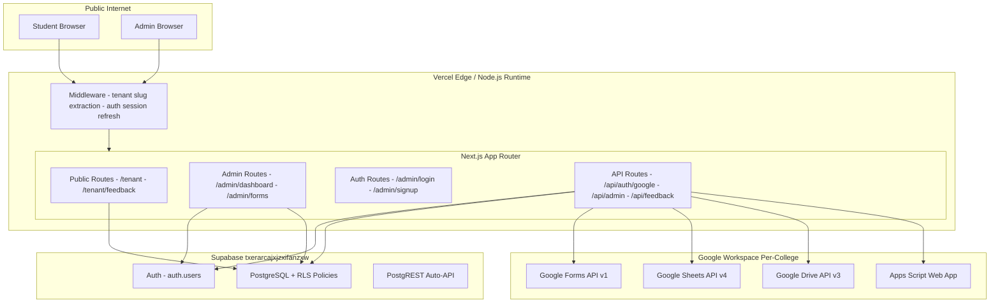
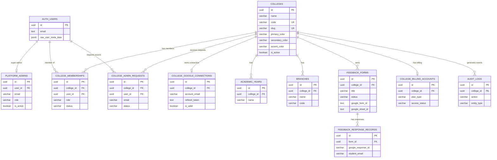
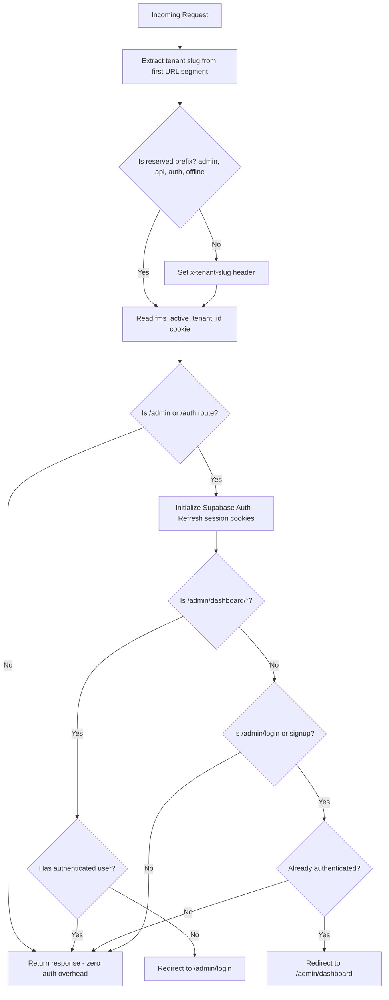
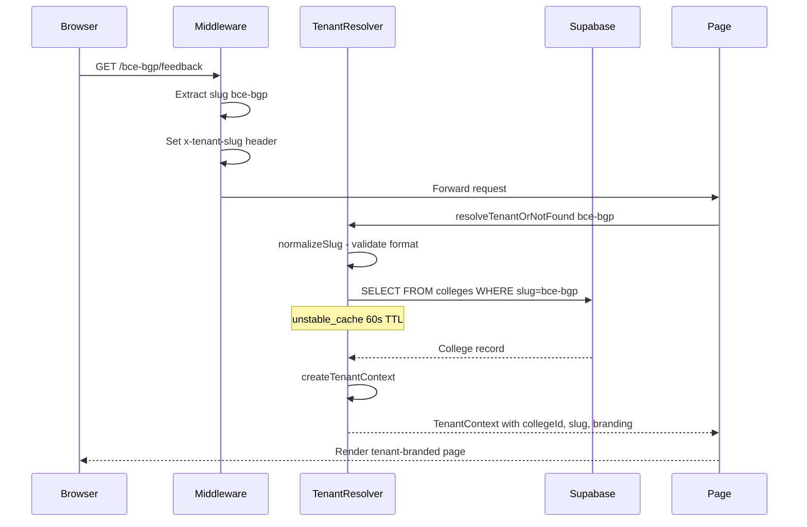
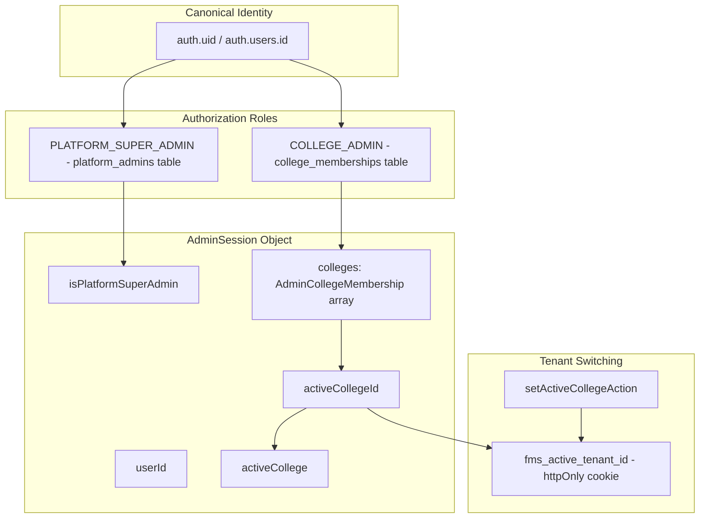
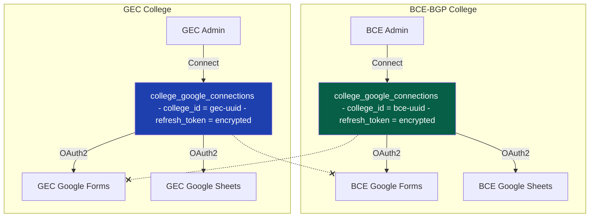
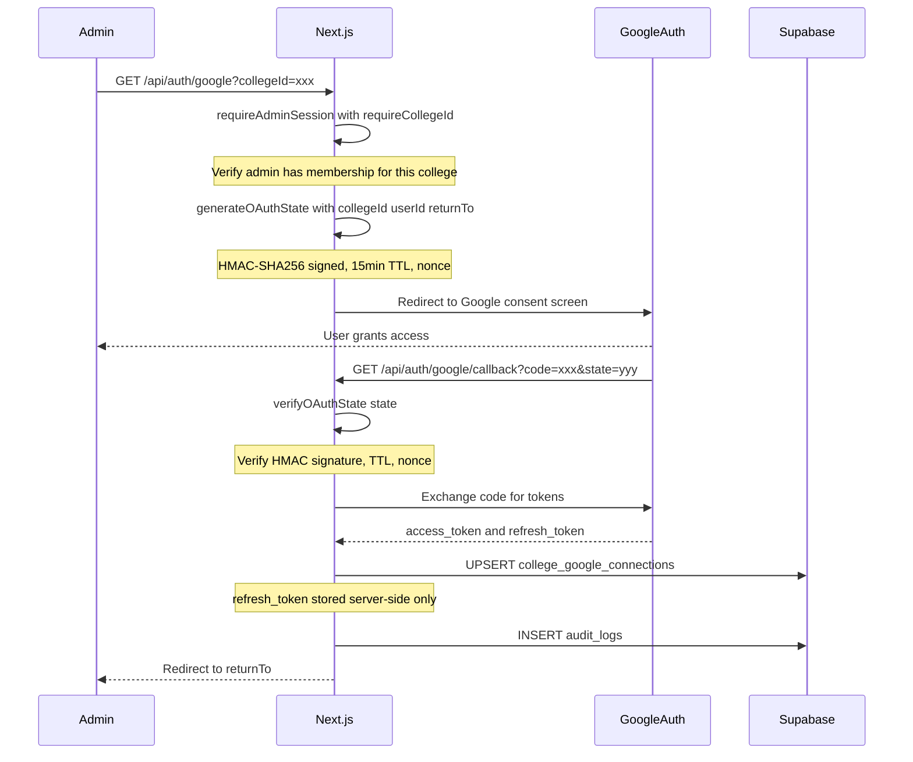

# FMS — Complete Architecture Analysis

> **Build Status: ✅ PASS** | Next.js 15.5.25 | TypeScript | 0 errors, 0 warnings
> **Date:** 2026-09-22 | **Supabase:** `txerarcajxjzxifanzxw`

---

## 1. Phase Completion Status

| Phase | Description | Status |
|-------|-------------|--------|
| **Phase 1** | Multi-Tenant Database + RLS + Seed | ✅ Deployed & Verified |
| **Phase 1C** | 3 Security Vulnerability Patches | ✅ Applied & Reviewed |
| **Phase 1D** | First Remote Migration Push | ✅ Deployed to `txerarcajxjzxifanzxw` |
| **Phase 2A** | Tenant Resolver (slug -> college) | ✅ Complete |
| **Phase 2B** | Admin Auth + Memberships + Switcher | ✅ Complete |
| **Phase 3** | College Google Connections (OAuth Multi-Tenancy) | ✅ Complete |
| **Phase 4** | Analytics + PDF Tenant Branding | ⏳ Pending |
| **Phase 5** | Billing / Entitlements | ⏳ Pending |

---

## 2. System Architecture Overview



---

## 3. Database Schema (7 Migrations)

### Migration Sequence

| # | File | Purpose |
|---|------|---------|
| 1 | [phase1_platform_and_tenants.sql](file:///D:/Feedback%20Management%20System/supabase/migrations/20260922000001_phase1_platform_and_tenants.sql) | Colleges, platform_admins, memberships, admin_requests, auth functions |
| 2 | [phase2_academic_structure.sql](file:///D:/Feedback%20Management%20System/supabase/migrations/20260922000002_phase2_academic_structure.sql) | academic_years, branches, semesters, faculties, subjects, assignments |
| 3 | [phase3_feedback_structure.sql](file:///D:/Feedback%20Management%20System/supabase/migrations/20260922000003_phase3_feedback_structure.sql) | feedback_forms, feedback_form_items, feedback_response_records |
| 4 | [phase4_google_connections.sql](file:///D:/Feedback%20Management%20System/supabase/migrations/20260922000004_phase4_google_connections.sql) | college_google_connections (tenant-scoped OAuth), college_google_status view |
| 5 | [phase5_billing_and_entitlements.sql](file:///D:/Feedback%20Management%20System/supabase/migrations/20260922000005_phase5_billing_and_entitlements.sql) | billing_plans, payment_settings, college_billing_accounts, trial_entitlements, payment_requests |
| 6 | [phase6_audit_and_rls.sql](file:///D:/Feedback%20Management%20System/supabase/migrations/20260922000006_phase6_audit_and_rls.sql) | audit_logs, RLS policies for ALL tables, explicit grants |
| 7 | [phase7_seed_initial_platform.sql](file:///D:/Feedback%20Management%20System/supabase/migrations/20260922000007_phase7_seed_initial_platform.sql) | Billing plans catalog, BCE-BGP seed tenant, Super Admin trigger |

### Entity-Relationship Diagram



### Security Functions (SECURITY DEFINER)

| Function | Purpose | Used By |
|----------|---------|---------|
| `is_platform_super_admin(auth_user_id)` | Checks `platform_admins` for active super admin | All RLS policies |
| `is_college_admin(auth_user_id, college_id)` | Checks membership OR super admin status | Tenant-scoped RLS |
| `get_user_college_ids(auth_user_id)` | Returns all college IDs user can access | Multi-tenant queries |
| `sync_platform_super_admin(user_id, email, name)` | Bootstrap super admin on registration | Auth trigger |

### RLS Enforcement Summary

| Table | anon | authenticated (own) | authenticated (admin) | service_role |
|-------|------|---------------------|----------------------|--------------|
| `colleges` | SELECT (active only) | SELECT (active only) | ALL (super admin) | ALL |
| `platform_admins` | DENIED | DENIED | ALL (super admin) | ALL |
| `college_memberships` | DENIED | SELECT (own) | ALL (own college admin) | ALL |
| `college_google_connections` | DENIED | DENIED | DENIED | ALL |
| `feedback_forms` | SELECT (published) | SELECT (published) | ALL (college admin) | ALL |
| `audit_logs` | DENIED | DENIED | SELECT (own college) | ALL |

> [!IMPORTANT]
> `college_google_connections` has **ALL privileges revoked** from anon/authenticated. Only `service_role` can read/write refresh tokens. The safe `college_google_status` view exposes metadata without tokens.

---

## 4. Application Architecture

### 4.1 Route Map (33 Routes)

```
src/app/
+-- layout.tsx                          # Root layout (PWA, navigation progress)
+-- page.tsx                            # Landing / college directory
+-- not-found.tsx                       # 404 page
+-- globals.css                         # Global styles
|
+-- [tenant]/                           # DYNAMIC TENANT ROUTES
|   +-- page.tsx                        # College home (resolved by slug)
|   +-- feedback/
|       +-- page.tsx                    # Public feedback forms list
|       +-- [id]/page.tsx              # Individual feedback form page
|
+-- admin/                              # ADMIN DASHBOARD
|   +-- login/page.tsx                  # Supabase Auth login
|   +-- signup/page.tsx                 # Supabase Auth signup
|   +-- forgot-password/page.tsx        # Password recovery
|   +-- reset-password/page.tsx         # Password reset
|   +-- pending/page.tsx                # Pending admin request
|   +-- actions.ts                      # Admin server actions (49KB)
|   +-- dashboard/
|       +-- layout.tsx                  # Dashboard shell + tenant switcher
|       +-- page.tsx                    # Main dashboard
|       +-- forms/                      # Feedback form management
|       |   +-- page.tsx               # Form list
|       |   +-- create/page.tsx        # Create form wizard
|       |   +-- [id]/page.tsx          # Form detail + sync
|       +-- results/                    # Analytics and results
|           +-- page.tsx               # Results overview
|           +-- [id]/page.tsx          # Form analytics
|           +-- [id]/responses/page.tsx # Individual responses
|
+-- api/                                # API ROUTES
|   +-- auth/google/
|   |   +-- route.ts                   # OAuth initiation (signed state)
|   |   +-- callback/route.ts          # OAuth callback (token exchange)
|   +-- admin/
|   |   +-- forms/[id]/sync/route.ts   # Response sync API
|   |   +-- forms/stream-generate/     # SSE form generation
|   |   +-- request-access/route.ts    # Admin onboarding
|   |   +-- results/[id]/pdf/route.ts  # Analytics PDF export
|   |   +-- results/export-pdf/        # Bulk PDF export
|   |   +-- verify-session/route.ts    # Session verification
|   +-- feedback/response/download/    # Student response download
|
+-- auth/callback/                      # Supabase Auth callback
+-- feedback/                           # Legacy feedback routes
+-- offline/                            # PWA offline page
```

### 4.2 Middleware Pipeline

[middleware.ts](file:///D:/Feedback%20Management%20System/src/middleware.ts)



> [!TIP]
> **Performance optimization:** Public routes (`/[tenant]/*`, `/feedback/*`) skip Supabase Auth initialization entirely, eliminating database overhead for student-facing pages.

---

## 5. Multi-Tenant Architecture

### 5.1 Tenant Resolution Flow



### 5.2 Key Tenant Resolver Features

| Feature | Implementation |
|---------|---------------|
| **Slug validation** | Regex: `^[a-z0-9]+(?:-[a-z0-9]+)*$` (1-50 chars) |
| **Cross-request cache** | `unstable_cache` with 60s TTL, tagged `['colleges', 'tenant_{slug}']` |
| **Per-request dedup** | React `cache()` prevents duplicate DB queries in same request |
| **Fail-closed** | `resolveTenantOrNotFound()` calls `notFound()` if slug invalid/inactive |
| **Branding extraction** | Extracts `primaryColor`, `secondaryColor`, `accentColor`, `logoUrl` |

### 5.3 Admin Authorization Model



**Key Security Invariants:**

| Rule | Enforcement |
|------|-------------|
| `auth.uid()` is the **only** canonical identity | Never use email as authorization proof |
| `college_id` is **never** trusted from client | Always resolved from DB form ownership |
| Platform Super Admin sees **all active colleges** | `is_platform_super_admin()` checks `colleges WHERE is_active=true` |
| College Admin sees **only own memberships** | `college_memberships WHERE status='ACTIVE'` |
| Active tenant cookie is a **hint only**, not auth proof | Server always verifies membership |

---

## 6. Google Workspace Multi-Tenancy (Phase 3)

### 6.1 Per-College Google Connection Architecture



### 6.2 OAuth Flow (College Connection)



### 6.3 Google Service Module Architecture

| Module | File | Purpose |
|--------|------|---------|
| **Auth** | [auth.ts](file:///D:/Feedback%20Management%20System/src/lib/google/auth.ts) | OAuth state signing, credential factory, connection lifecycle, error classification (623 lines) |
| **Forms** | [forms.ts](file:///D:/Feedback%20Management%20System/src/lib/google/forms.ts) | Create forms, validate structure, get responses (196 lines) |
| **Sheets** | [sheets.ts](file:///D:/Feedback%20Management%20System/src/lib/google/sheets.ts) | Create spreadsheets, append responses, read existing IDs (304 lines) |
| **Sync** | [sync.ts](file:///D:/Feedback%20Management%20System/src/lib/google/sync.ts) | Idempotent response sync (Forms to Sheet to DB + email), tenant auth enforcement (532 lines) |
| **Linking** | [linking.ts](file:///D:/Feedback%20Management%20System/src/lib/google/linking.ts) | Apps Script connector, native sheet destination, confirmation message (224 lines) |
| **Template** | [template.ts](file:///D:/Feedback%20Management%20System/src/lib/google/template.ts) | BCE feedback parameters, form question templates, multi-faculty grids (13KB) |
| **Actions** | [actions.ts](file:///D:/Feedback%20Management%20System/src/lib/google/actions.ts) | Server actions for connection status/disconnect (77 lines) |

### 6.4 Credential Access Pattern

```
+---------------------------------------------+
| Server-Side ONLY (Node.js Runtime)          |
|                                             |
|  getCollegeGoogleCredentials(collegeId)     |
|  +-- Uses createAdminClient() (service_role)|
|  +-- Reads refresh_token from DB            |
|  +-- NEVER returns to client                |
|                                             |
|  getCollegeGoogleAuthClient(collegeId)      |
|  +-- Calls getCollegeGoogleCredentials()    |
|  +-- Creates OAuth2Client with refresh_token|
|  +-- Returns authenticated client           |
|                                             |
|  getCollegeGoogleServices(collegeId)        |
|  +-- Calls getCollegeGoogleAuthClient()     |
|  +-- Returns { forms, sheets, drive }       |
|                                             |
|  executeWithCollegeGoogleOAuthRetry()       |
|  +-- Wraps any Google API operation         |
|  +-- Auto-detects invalid_grant errors      |
|  +-- Marks connection invalid in DB         |
|                                             |
+---------------------------------------------+
| Client-Safe APIs                            |
|                                             |
|  getCollegeGoogleConnectionMetadata()       |
|  +-- Returns ONLY: email, name, isValid,    |
|      scopes, connectedAt (NO refresh_token) |
|                                             |
|  college_google_status (SQL View)           |
|  +-- Excludes refresh_token column          |
|      + RLS: only own college visible        |
+---------------------------------------------+
```

> [!CAUTION]
> **Security Invariant:** `refresh_token` is NEVER exposed to:
> - Client browser bundles
> - API JSON responses
> - Logs or error messages
> - The `college_google_status` view

---

## 7. Complete File Inventory

### Source Code (src/)

| Directory | Files | Purpose |
|-----------|-------|---------|
| [middleware.ts](file:///D:/Feedback%20Management%20System/src/middleware.ts) | 1 | Request pipeline: slug extraction, auth refresh, route protection |
| [src/types/](file:///D:/Feedback%20Management%20System/src/types) | 3 | `database.ts`, `tenant.ts`, `auth.ts` - full TypeScript types |
| [src/lib/tenant/](file:///D:/Feedback%20Management%20System/src/lib/tenant) | 1 | `resolver.ts` - slug to TenantContext |
| [src/lib/auth/](file:///D:/Feedback%20Management%20System/src/lib/auth) | 2 | `admin-auth.ts`, `tenant-actions.ts` - admin session, tenant switching |
| [src/lib/supabase/](file:///D:/Feedback%20Management%20System/src/lib/supabase) | 4 | `server.ts`, `client.ts`, `admin.ts`, `academic-cache.ts` |
| [src/lib/google/](file:///D:/Feedback%20Management%20System/src/lib/google) | 7 | `auth.ts`, `forms.ts`, `sheets.ts`, `sync.ts`, `linking.ts`, `template.ts`, `actions.ts` |
| [src/lib/analytics/](file:///D:/Feedback%20Management%20System/src/lib/analytics) | 6 | `engine.ts`, `normalizer.ts`, `pdf-generator.ts`, `service.ts`, `sheets-reader.ts`, `types.ts` |
| [src/lib/billing/](file:///D:/Feedback%20Management%20System/src/lib/billing) | 2 | `access-control.ts`, `constants.ts` |
| [src/lib/feedback/](file:///D:/Feedback%20Management%20System/src/lib/feedback) | 1 | `response-token.ts` - JWT-based response download tokens |
| [src/lib/email/](file:///D:/Feedback%20Management%20System/src/lib/email) | - | Email service for student confirmation emails |
| [src/components/admin/](file:///D:/Feedback%20Management%20System/src/components/admin) | 7+ | Dashboard tabs, header, mobile nav, billing, forms, results components |
| [src/components/public/](file:///D:/Feedback%20Management%20System/src/components/public) | - | Public-facing components |
| [src/components/ui/](file:///D:/Feedback%20Management%20System/src/components/ui) | - | Navigation progress, interaction effects |
| [src/components/pwa/](file:///D:/Feedback%20Management%20System/src/components/pwa) | - | Service worker, install prompt, network status |

### Dependencies

| Package | Version | Purpose |
|---------|---------|---------|
| `next` | ^15.2.0 | App Router, Server Components, Server Actions |
| `react` / `react-dom` | ^19.0.0 | UI framework |
| `@supabase/supabase-js` | ^2.49.1 | Database client |
| `@supabase/ssr` | ^0.5.2 | Server-side auth with cookie management |
| `googleapis` | ^180.0.0 | Google Forms, Sheets, Drive APIs |
| `recharts` | ^3.10.1 | Analytics charts |
| `pdfkit` | ^0.20.2 | PDF report generation |
| `zod` | ^3.24.2 | Schema validation |
| `lucide-react` | ^0.477.0 | Icons |
| `tailwindcss` | ^3.4.17 | Utility-first CSS |

---

## 8. Build Output Summary

```
Compiled successfully in 35.6s
Generating static pages (12/12)

Static Pages:   7 pages  (login, signup, forgot-password, reset-password, pending, confirmation, offline)
Dynamic Pages:  26 routes (all data-driven pages)
Middleware:     94 kB
Shared JS:      103 kB
```

### Route Size Analysis

| Route | Size | First Load JS |
|-------|------|---------------|
| `/` (Landing) | 212 B | 190 kB |
| `/[tenant]` | 212 B | 190 kB |
| `/admin/dashboard` | 11.2 kB | 185 kB |
| `/admin/dashboard/forms/create` | 12.9 kB | 123 kB |
| `/admin/dashboard/results` | 4.77 kB | 242 kB |
| `/admin/dashboard/results/[id]` | 6.16 kB | 243 kB |

> [!NOTE]
> The results pages have the highest first-load JS (242-243 kB) due to Recharts bundle. All other pages are well within acceptable limits.

---

## 9. Security Architecture Summary

### Defense Layers

```
Layer 1: Middleware
+-- Tenant slug extraction and validation
+-- Supabase Auth session refresh (admin/auth routes only)
+-- Route protection (unauthenticated redirected to /admin/login)

Layer 2: Server Components and Actions
+-- getAdminSession() - canonical auth.uid() identity
+-- requireAdminSession({ requireCollegeId }) - membership enforcement
+-- Tenant-scoped database queries (college_id FK)

Layer 3: PostgreSQL RLS
+-- is_platform_super_admin(auth.uid())
+-- is_college_admin(auth.uid(), college_id)
+-- Public tables: SELECT only active records (anon)
+-- Admin tables: tenant-scoped USING clauses

Layer 4: Google OAuth Security
+-- HMAC-SHA256 signed state (tamper-proof)
+-- 15-minute state TTL + nonce
+-- Timing-safe signature comparison
+-- refresh_token: service_role only, never client
+-- returnTo URL validation (anti-open-redirect)
+-- Auto-invalidation on invalid_grant

Layer 5: Data API Hardening
+-- college_google_connections: ALL revoked from anon/authenticated
+-- college_google_status view: excludes refresh_token column
+-- RLS ensures tenant isolation at database layer
```

---

## 10. Remaining Work (Phase 4 and 5)

### Phase 4 - Analytics + PDF Tenant Branding
- [ ] Scope analytics engine to `college_id`
- [ ] Tenant-branded PDF headers (logo, colors, college name)
- [ ] College-specific analytics dashboard filtering
- [ ] Sheets reader scoped to college Google connection

### Phase 5 - Billing / Entitlements
- [ ] College-level billing (replace admin-level billing)
- [ ] `college_billing_accounts` integration with access control
- [ ] `college_trial_entitlements` grant/revoke workflow
- [ ] Payment request approval scoped to platform admin
- [ ] Feature-gated access based on active plan

---

## 11. Platform Super Admin

| Property | Value |
|----------|-------|
| **Email** | `iambestadi@gmail.com` |
| **User ID** | `e606b509-7864-4150-8666-a6e47a63abc4` |
| **Bootstrap** | Automatic via `trg_sync_super_admin_on_registration` trigger |
| **BCE Membership** | Auto-created `COLLEGE_ADMIN` for `bce00000-0000-0000-0000-000000000001` |
| **Capabilities** | Access all colleges, manage platform admins, approve/reject admin requests |
